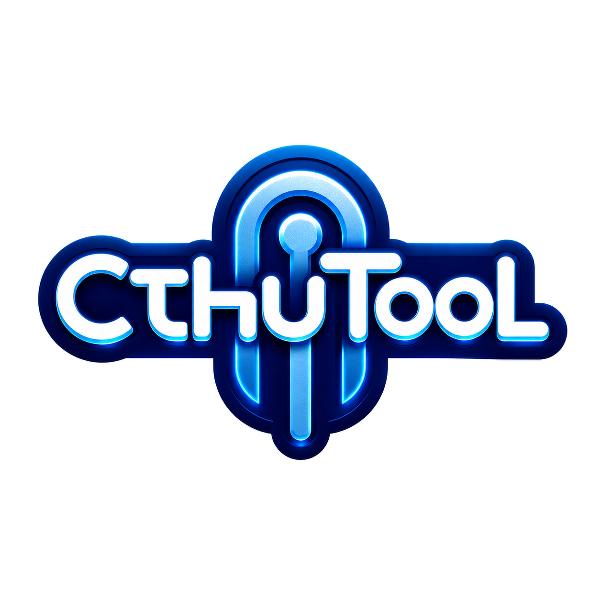

# CthuTool

<p align="center">
  
</p>

CthuTool is a homelab-oriented Turborepo monorepo with backend/web services, desktop client workflows, CLI tooling, browser automation support, and Codex-facing assets.

For user-facing deployment, installation, module usage, operations, and architecture docs, start with the docs site in `apps/docs/`:

```bash
pnpm --filter @cthutool/docs dev
```

## Prerequisites

- **Node.js** 24.x (see `engines` and `volta` in root `package.json`).
- **pnpm** 9.15.4 (see `packageManager` in root `package.json`). Recommended:

  ```bash
  corepack enable
  corepack prepare pnpm@9.15.4 --activate
  ```
- **Bun** for CLI build and tests (`apps/cli` uses `bun build` and `bun test`).

## Install

From the repository root:

```bash
pnpm install
```

After installing dependencies, use the root commands as the canonical check
surface for the root-managed workspace:

```bash
pnpm run lint
pnpm run typecheck
pnpm run test
pnpm run build
```

## Personal CLI Install

Target machines only need `git`, Node.js 24.x, and `npm` to install or update
the global `chc` CLI. The installer uses the committed
`apps/cli/dist/index.js` bundle and does not run `pnpm` or `bun` on the target
machine.

```bash
curl -fsSL https://raw.githubusercontent.com/mickmetalholic/CthuTool/main/scripts/install-chc.sh | bash
chc --help
```

When the user's login shell is zsh, the installer also enables persistent `chc`
completion in the user's zsh profile. Set `CHC_INSTALL_COMPLETION=none` to skip
this step.

The public raw installer runs in remote mode. It clones or updates
`https://github.com/mickmetalholic/CthuTool.git` into
`~/.cthutool/source/CthuTool`, verifies the committed CLI bundle, and runs
`npm install -g --ignore-scripts` for the root package that exposes `chc`.

For local checkout development, run the installer from the checkout:

```bash
scripts/install-chc.sh
pnpm --filter @cthutool/cli dev
chc --help
```

Local script execution runs in local mode by default. It installs global `chc`
from the repository containing `scripts/install-chc.sh`, so the command follows
that checkout while the `dev` script rebuilds `apps/cli/dist/index.js`.

To restore global `chc` to the managed checkout after local development:

```bash
CHC_INSTALL_MODE=remote scripts/install-chc.sh
```

Use environment variables to install a different source or version:

```bash
curl -fsSL https://raw.githubusercontent.com/mickmetalholic/CthuTool/main/scripts/install-chc.sh | CHC_REF=v0.1.0 bash
CHC_INSTALL_MODE=remote CHC_REF=v0.1.0 scripts/install-chc.sh
CHC_INSTALL_MODE=remote CHC_REPO_URL=https://github.com/mickmetalholic/CthuTool.git CHC_INSTALL_DIR="$HOME/.cthutool/source/CthuTool" scripts/install-chc.sh
CHC_INSTALL_COMPLETION=none scripts/install-chc.sh
```

`CHC_INSTALL_MODE` accepts `auto`, `local`, or `remote`. In `auto` mode, which
is the default, raw stdin execution selects `remote` and local file execution
selects `local`. Repository, ref, and install-dir overrides apply to `remote`
mode. `CHC_INSTALL_COMPLETION` accepts `auto`, `zsh`, or `none`.

After the first install, update from the CLI:

```bash
chc --version
chc status
chc update --check
chc update
chc update --ref v0.1.0
```

Use `chc --version` for the lightweight version-only check. `chc status`
includes that version together with the detected installation mode and source
checkout diagnostics. For the default remote managed installation,
`chc update --check` and `chc update` follow that checkout's existing origin and
checked-out branch, exact tag, or commit. A safe managed update reports the
planned commit, validates the committed bundle before checkout, and skips the
global reinstall when already current.

When `chc status` reports `mode: local`, the command follows that development
checkout and default update/check commands do not mutate it or the separate
managed checkout. Update the repository with the normal Git workflow and
refresh `apps/cli/dist/index.js` with `pnpm --filter @cthutool/cli dev`. Use
`CHC_INSTALL_MODE=remote scripts/install-chc.sh` to switch the global command
back to managed mode. Advanced callers can explicitly select another source
with `--install-dir`, `--repo`, and `--ref`; a successful apply relinks the
global command to that directory. Dirty, diverged, or invalid-bundle targets are
blocked without automatic stash, reset, clean, or rebase. Update checks are
explicit; the CLI does not run a periodic background checker.

Discover command groups and bundled scripts directly from the CLI:

```bash
chc completion
chc scripts
chc scripts list
chc scripts run convert-to-cbz --input ./samples
```

`chc completion` lists the `powershell`, `zsh`, `enable`, `disable`, and
`status` operations. `chc scripts` shows `list`, `run`, and an
`AVAILABLE SCRIPTS` catalog. Existing `chc scripts <id>` and
`chc scripts --script <id>` forms remain supported as shorthand for
`chc scripts run <id>`.

For full install, update, uninstall, and command usage docs, use the docs site
under `apps/docs/src/content/docs/client/cli.md` and
`apps/docs/src/content/docs/modules/cli.md`.

When changing CLI source, refresh and commit the runtime bundle in the same
change. The pre-commit hook automatically runs this refresh and stages
`apps/cli/dist/index.js` when staged CLI bundle inputs change, but the commands
remain useful for explicit verification:

```bash
pnpm --filter @cthutool/cli build
pnpm run check:cli-dist
```

## Common commands

| Command | Description |
| --- | --- |
| `pnpm run build` | Runs `turbo run build` across workspace members. |
| `pnpm run check:cli-dist` | Verifies the committed CLI bundle matches source. |
| `pnpm run lint` | Runs `biome check .` at repo root. |
| `pnpm run lint:fix` | Runs `biome check --write .` at repo root. |
| `pnpm run typecheck` | Runs `turbo run typecheck` across workspace members. |
| `pnpm run test` | Runs root Jest tests plus workspace tests via Turborepo. |

## Layout

- **`apps/`** — application packages (`apps/*` are matched by `pnpm-workspace.yaml`), including backend, CLI, and desktop apps.
- **`packages/`** — libraries and tooling packages (`packages/*`), including shared protocol and package tooling.
- **Package names** — use the `@cthutool/*` scope (see **Naming** below).

### Naming and directories

- Put apps under `apps/<name>/` with a `package.json` named `@cthutool/<name>` (or your chosen suffix under the scope).
- Put libraries under `packages/<name>/` with `name`: `@cthutool/<name>`.
- Ensure `pnpm-workspace.yaml` globs (`apps/*`, `packages/*`) cover new folders; you do **not** need to duplicate root scripts — `pnpm run build` / `pnpm run test` already orchestrate the whole workspace via Turborepo.

## CI

GitHub Actions (`.github/workflows/ci.yml`) runs:

- Commitlint (on `pull_request` and `push`)
- `pnpm run lint` (Biome)
- `pnpm run typecheck` (Turborepo)
- `pnpm run test` (with `SKIP_ROOT_WORKSPACE_CHECK=true`)

The workflow triggers on `push` to `main` and on `pull_request`, so Biome and commit message gates stay consistent between local and CI.

## Biome quality gates

### Editor gate (Cursor / VS Code)

- Repository default settings are in `.vscode/settings.json`.
- Diagnostics are enabled while typing (onType via Biome language service).
- Format on save is enabled and defaults to Biome.

### Pre-commit gate

- `.husky/pre-commit` only checks staged files under `apps/` and `packages/`.
- The hook blocks commit on failure and prints a direct fix command.

### Commitlint boundary

- Commitlint validates commit message format.
- Biome validates source formatting and lint rules.
- The two gates run independently to avoid responsibility overlap.

## More documentation

- User and operator docs site: `apps/docs/` (`pnpm --filter @cthutool/docs dev`).
- Homelab deployment and operations: `apps/docs/src/content/docs/deployment/` and `apps/docs/src/content/docs/operations/`.
- Client installation: `apps/docs/src/content/docs/client/`.
- Module usage: `apps/docs/src/content/docs/modules/`.
- Architecture: `apps/docs/src/content/docs/architecture/`.
- Documentation source boundaries: `docs/README.md`.
- Package-local development notes live in package `README.md` files such as `apps/cli/README.md` and `apps/backend/README.md`.
- OpenSpec requirements live under `openspec/specs/`.
