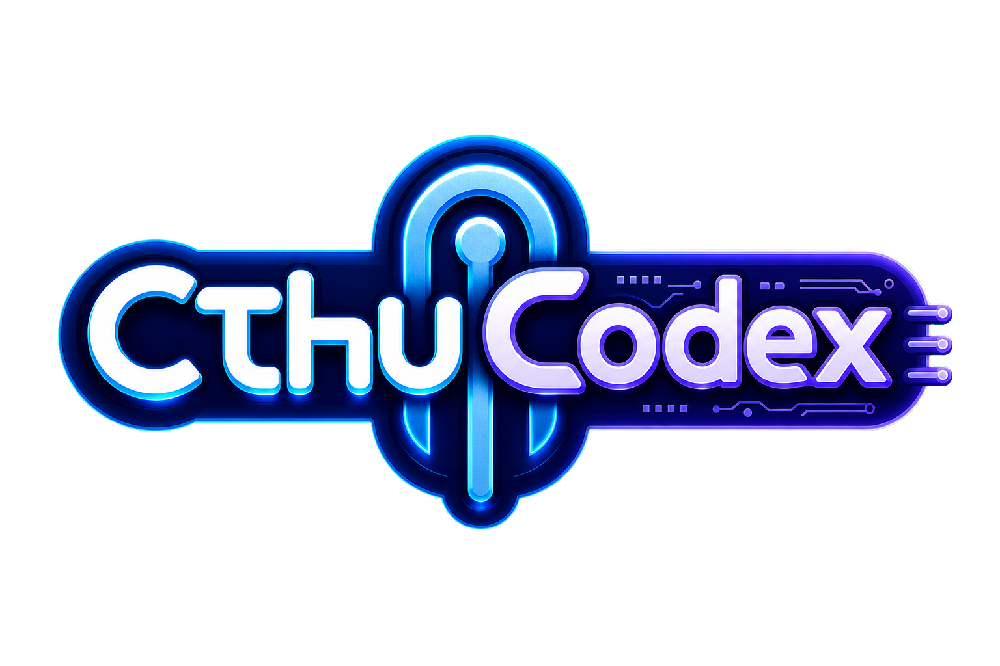

# CthuCodex

<p align="center">
  
</p>

CthuCodex is the repository-managed Codex plugin for CthuTool workflows and reusable assistant utilities.

## Utilities

- **Language coach hook** - checks English prose before continuing with the user's request.
- **Anki MCP server** - connects to local AnkiConnect to read collection context, validate candidate notes, create cards, store media, and open notes in Anki's Browser for review.

## Anki MCP Server

The Anki tools require Anki desktop with the AnkiConnect add-on running locally. By default, CthuCodex connects to:

```text
http://127.0.0.1:8765
```

Set `CTHU_ANKI_CONNECT_URL` or `ANKI_CONNECT_URL` to override the endpoint.

Available tools:

- `cthu_anki_status` - check whether AnkiConnect is reachable.
- `cthu_anki_collection_schema` - read decks, note types, fields, templates, and tags.
- `cthu_anki_find_notes` - search notes with Anki browser query syntax.
- `cthu_anki_get_notes` - read note details by note ID.
- `cthu_anki_validate_notes` - validate candidate notes before writing.
- `cthu_anki_add_notes` - validate and create notes, optionally with `openAfterCreate`.
- `cthu_anki_store_media` - store media files before note fields reference them.
- `cthu_anki_open_notes` - open existing note IDs in Anki's Browser.

`cthu_anki_add_notes` uses validation before writing and limits batch size. When `openAfterCreate` is true, it opens created notes with an Anki Browser search like `nid:123 OR nid:456`. Browser opening failures are reported as warnings and do not undo successful note creation.

## Install

From the repository root:

```bash
chc codex install
```

After install, start a new Codex thread or restart Codex so the bundled MCP
server is loaded. In a fresh thread, use `/mcp` to verify the `anki` server and
its tools are available.
